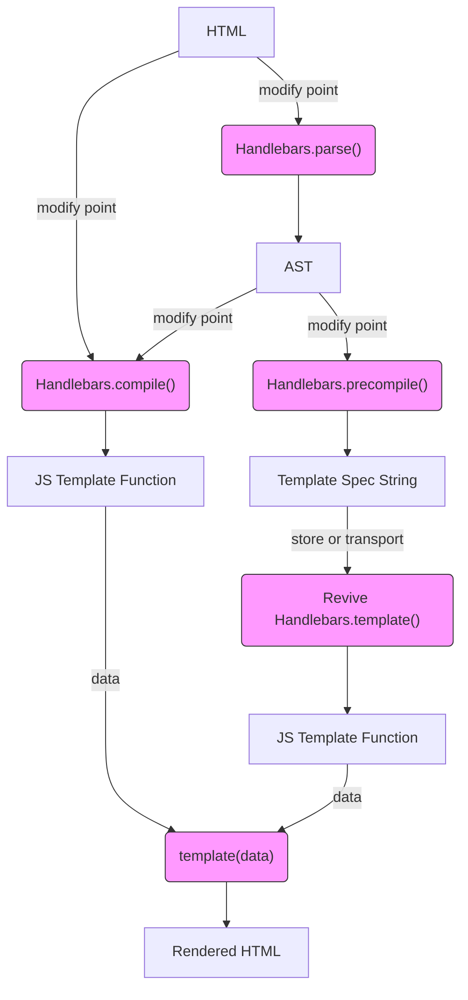

# Diagrams

- [Three Handlebars Workflow](https://mermaidjs.github.io/mermaid-live-editor/#/edit/eyJjb2RlIjoiZ3JhcGggVERcbkhUTUwgLS0-IHxtb2RpZnkgcG9pbnR8Zm5jQ29tcGlsZVxuSFRNTCAtLT58bW9kaWZ5IHBvaW50fGZuY1BhcnNlKFwiSGFuZGxlYmFycy5wYXJzZSgpXCIpXG5mbmNQYXJzZSAtLT4gQVNUXG5BU1QgLS0-fG1vZGlmeSBwb2ludHxmbmNDb21waWxlKFwiSGFuZGxlYmFycy5jb21waWxlKClcIilcbkFTVCAtLT58bW9kaWZ5IHBvaW50fGZuY1ByZWNvbXBpbGUoXCJIYW5kbGViYXJzLnByZWNvbXBpbGUoKVwiKVxuZm5jQ29tcGlsZSAtLT4gRltKUyBUZW1wbGF0ZSBGdW5jdGlvbl1cbkYgLS0-IHxkYXRhfGZuY1RlbXBsYXRlKFwidGVtcGxhdGUoZGF0YSlcIilcbmZuY1ByZWNvbXBpbGUgLS0-IEdbVGVtcGxhdGUgU3BlYyBTdHJpbmddXG5HIC0tPnxzdG9yZSBvciB0cmFuc3BvcnR8Zm5jUmV2aXZlKFwiUmV2aXZlIEhhbmRsZWJhcnMudGVtcGxhdGUoKVwiKVxuZm5jUmV2aXZlIC0tPkpbSlMgVGVtcGxhdGUgRnVuY3Rpb25dXG5KIC0tPiB8ZGF0YXxmbmNUZW1wbGF0ZShcInRlbXBsYXRlKGRhdGEpXCIpXG5mbmNUZW1wbGF0ZSAtLT5SSFRNTFtSZW5kZXJlZCBIVE1MXVxuXG5cbmNsYXNzRGVmIGZuY1N0eWxlIGZpbGw6I2Y5ZixzdHJva2U6IzMzMyxzdHJva2Utd2lkdGg6MXB4O1xuY2xhc3MgZm5jUGFyc2UgZm5jU3R5bGU7XG5jbGFzcyBmbmNDb21waWxlIGZuY1N0eWxlO1xuY2xhc3MgZm5jUHJlY29tcGlsZSBmbmNTdHlsZTtcbmNsYXNzIGZuY1Jldml2ZSBmbmNTdHlsZTtcbmNsYXNzIGZuY1RlbXBsYXRlIGZuY1N0eWxlO1xuIiwibWVybWFpZCI6eyJ0aGVtZSI6ImRlZmF1bHQifX0)

