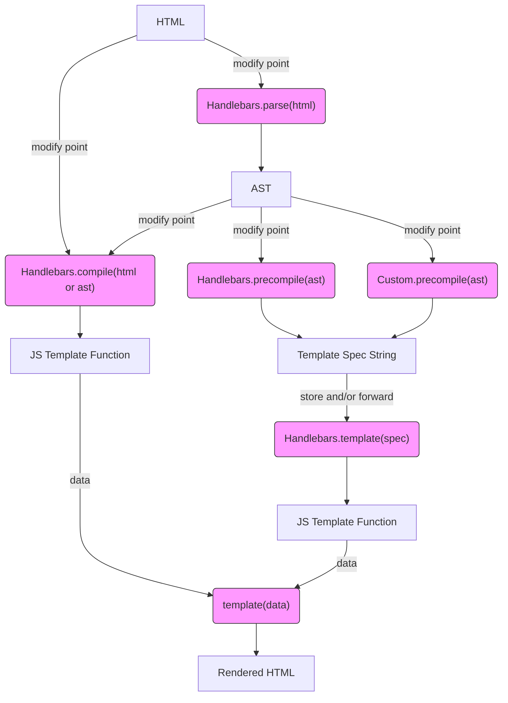

# Diagrams

- [Handlebars Workflow](https://mermaidjs.github.io/mermaid-live-editor/#/edit/eyJjb2RlIjoiZ3JhcGggVERcbkhUTUwgLS0-IHxtb2RpZnkgcG9pbnR8Zm5jQ29tcGlsZVxuSFRNTCAtLT58bW9kaWZ5IHBvaW50fGZuY1BhcnNlKFwiSGFuZGxlYmFycy5wYXJzZShodG1sKVwiKVxuZm5jUGFyc2UgLS0-IEFTVFxuQVNUIC0tPnxtb2RpZnkgcG9pbnR8Zm5jQ29tcGlsZShcIkhhbmRsZWJhcnMuY29tcGlsZShodG1sIG9yIGFzdClcIilcbkFTVCAtLT58bW9kaWZ5IHBvaW50fGZuY1ByZWNvbXBpbGUoXCJIYW5kbGViYXJzLnByZWNvbXBpbGUoYXN0KVwiKVxuQVNUIC0tPnxtb2RpZnkgcG9pbnR8Zm5jUHJlY29tcGlsZUN1c3RvbShcIkN1c3RvbS5wcmVjb21waWxlKGFzdClcIilcbmZuY0NvbXBpbGUgLS0-IEZbSlMgVGVtcGxhdGUgRnVuY3Rpb25dXG5GIC0tPiB8ZGF0YXxmbmNUZW1wbGF0ZShcInRlbXBsYXRlKGRhdGEpXCIpXG5mbmNQcmVjb21waWxlIC0tPiBHW1RlbXBsYXRlIFNwZWMgU3RyaW5nXVxuZm5jUHJlY29tcGlsZUN1c3RvbSAtLT4gR1tUZW1wbGF0ZSBTcGVjIFN0cmluZ11cbkcgLS0-fHN0b3JlIGFuZC9vciBmb3J3YXJkfGZuY1Jldml2ZShcIkhhbmRsZWJhcnMudGVtcGxhdGUoc3BlYylcIilcbmZuY1Jldml2ZSAtLT5KW0pTIFRlbXBsYXRlIEZ1bmN0aW9uXVxuSiAtLT4gfGRhdGF8Zm5jVGVtcGxhdGUoXCJ0ZW1wbGF0ZShkYXRhKVwiKVxuZm5jVGVtcGxhdGUgLS0-UkhUTUxbUmVuZGVyZWQgSFRNTF1cblxuY2xhc3NEZWYgZm5jU3R5bGUgZmlsbDojZjlmLHN0cm9rZTojMzMzLHN0cm9rZS13aWR0aDoxcHg7XG5jbGFzcyBmbmNQYXJzZSBmbmNTdHlsZTtcbmNsYXNzIGZuY0NvbXBpbGUgZm5jU3R5bGU7XG5jbGFzcyBmbmNQcmVjb21waWxlIGZuY1N0eWxlO1xuY2xhc3MgZm5jUHJlY29tcGlsZUN1c3RvbSBmbmNTdHlsZTtcbmNsYXNzIGZuY1Jldml2ZSBmbmNTdHlsZTtcbmNsYXNzIGZuY1RlbXBsYXRlIGZuY1N0eWxlO1xuIiwibWVybWFpZCI6eyJ0aGVtZSI6ImRlZmF1bHQifX0)

