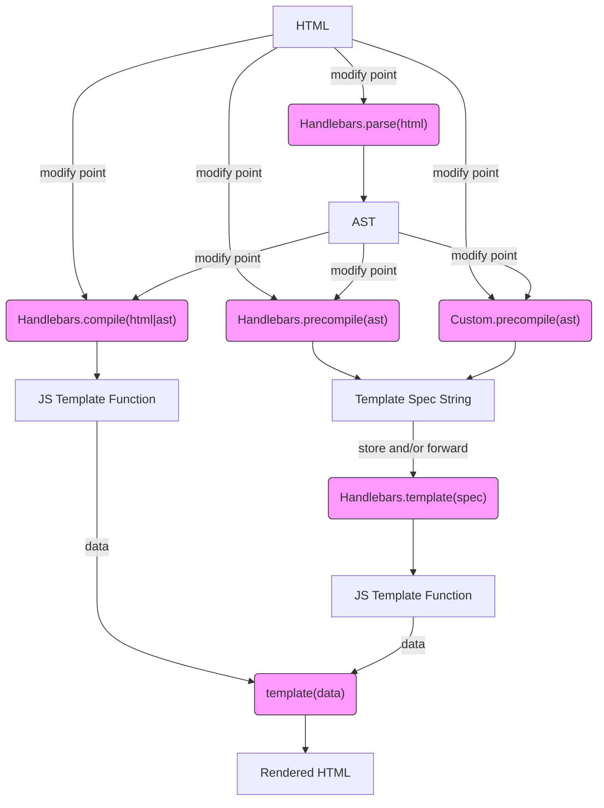

# Diagrams

- [Handlebars Workflow](https://mermaidjs.github.io/mermaid-live-editor/#/edit/eyJjb2RlIjoiZ3JhcGggVERcbkhUTUwgLS0-IHxtb2RpZnkgcG9pbnR8Zm5jQ29tcGlsZVxuSFRNTCAtLT4gfG1vZGlmeSBwb2ludHxmbmNQcmVjb21waWxlXG5IVE1MIC0tPiB8bW9kaWZ5IHBvaW50fGZuY1ByZWNvbXBpbGVDdXN0b21cbkhUTUwgLS0-fG1vZGlmeSBwb2ludHxmbmNQYXJzZShcIkhhbmRsZWJhcnMucGFyc2UoaHRtbClcIilcbmZuY1BhcnNlIC0tPiBBU1RcbkFTVCAtLT58bW9kaWZ5IHBvaW50fGZuY0NvbXBpbGUoXCJIYW5kbGViYXJzLmNvbXBpbGUoaHRtbHxhc3QpXCIpXG5BU1QgLS0-fG1vZGlmeSBwb2ludHxmbmNQcmVjb21waWxlKFwiSGFuZGxlYmFycy5wcmVjb21waWxlKGFzdClcIilcbkFTVCAtLT58bW9kaWZ5IHBvaW50fGZuY1ByZWNvbXBpbGVDdXN0b20oXCJDdXN0b20ucHJlY29tcGlsZShhc3QpXCIpXG5mbmNDb21waWxlIC0tPiBGW0pTIFRlbXBsYXRlIEZ1bmN0aW9uXVxuRiAtLT4gfGRhdGF8Zm5jVGVtcGxhdGUoXCJ0ZW1wbGF0ZShkYXRhKVwiKVxuZm5jUHJlY29tcGlsZSAtLT4gR1tUZW1wbGF0ZSBTcGVjIFN0cmluZ11cbmZuY1ByZWNvbXBpbGVDdXN0b20gLS0-IEdbVGVtcGxhdGUgU3BlYyBTdHJpbmddXG5HIC0tPnxzdG9yZSBhbmQvb3IgZm9yd2FyZHxmbmNSZXZpdmUoXCJIYW5kbGViYXJzLnRlbXBsYXRlKHNwZWMpXCIpXG5mbmNSZXZpdmUgLS0-SltKUyBUZW1wbGF0ZSBGdW5jdGlvbl1cbkogLS0-IHxkYXRhfGZuY1RlbXBsYXRlKFwidGVtcGxhdGUoZGF0YSlcIilcbmZuY1RlbXBsYXRlIC0tPlJIVE1MW1JlbmRlcmVkIEhUTUxdXG5cbmNsYXNzRGVmIGZuY1N0eWxlIGZpbGw6I2Y5ZixzdHJva2U6IzMzMyxzdHJva2Utd2lkdGg6MXB4O1xuY2xhc3MgZm5jUGFyc2UgZm5jU3R5bGU7XG5jbGFzcyBmbmNDb21waWxlIGZuY1N0eWxlO1xuY2xhc3MgZm5jUHJlY29tcGlsZSBmbmNTdHlsZTtcbmNsYXNzIGZuY1ByZWNvbXBpbGVDdXN0b20gZm5jU3R5bGU7XG5jbGFzcyBmbmNSZXZpdmUgZm5jU3R5bGU7XG5jbGFzcyBmbmNUZW1wbGF0ZSBmbmNTdHlsZTtcbiIsIm1lcm1haWQiOnsidGhlbWUiOiJkZWZhdWx0In19)

