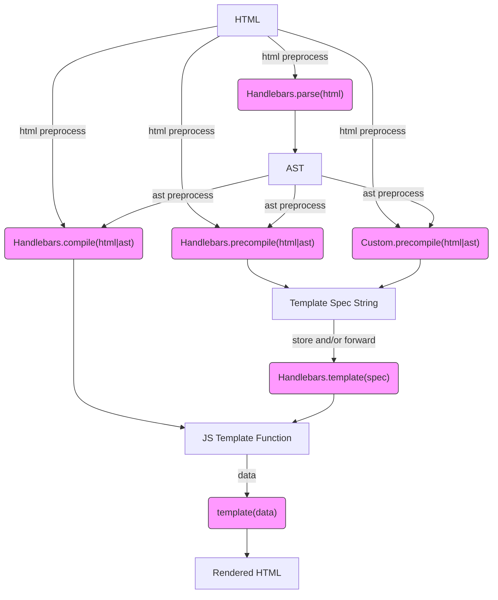

# Diagrams

- [Handlebars Workflow](https://mermaidjs.github.io/mermaid-live-editor/#/edit/eyJjb2RlIjoiZ3JhcGggVERcbkhUTUwgLS0-IHxodG1sIHByZXByb2Nlc3N8Zm5jQ29tcGlsZVxuSFRNTCAtLT4gfGh0bWwgcHJlcHJvY2Vzc3xmbmNQcmVjb21waWxlXG5IVE1MIC0tPiB8aHRtbCBwcmVwcm9jZXNzfGZuY1ByZWNvbXBpbGVDdXN0b21cbkhUTUwgLS0-fGh0bWwgcHJlcHJvY2Vzc3xmbmNQYXJzZShcIkhhbmRsZWJhcnMucGFyc2UoaHRtbClcIilcbmZuY1BhcnNlIC0tPiBBU1RcbkFTVCAtLT58YXN0IHByZXByb2Nlc3N8Zm5jQ29tcGlsZShcIkhhbmRsZWJhcnMuY29tcGlsZShodG1sfGFzdClcIilcbkFTVCAtLT58YXN0IHByZXByb2Nlc3N8Zm5jUHJlY29tcGlsZShcIkhhbmRsZWJhcnMucHJlY29tcGlsZShodG1sfGFzdClcIilcbkFTVCAtLT58YXN0IHByZXByb2Nlc3N8Zm5jUHJlY29tcGlsZUN1c3RvbShcIkN1c3RvbS5wcmVjb21waWxlKGh0bWx8YXN0KVwiKVxuZm5jQ29tcGlsZSAtLT4gRltKUyBUZW1wbGF0ZSBGdW5jdGlvbl1cbkYgLS0-IHxkYXRhfGZuY1RlbXBsYXRlKFwidGVtcGxhdGUoZGF0YSlcIilcbmZuY1ByZWNvbXBpbGUgLS0-IEdbVGVtcGxhdGUgU3BlYyBTdHJpbmddXG5mbmNQcmVjb21waWxlQ3VzdG9tIC0tPiBHW1RlbXBsYXRlIFNwZWMgU3RyaW5nXVxuRyAtLT58c3RvcmUgYW5kL29yIGZvcndhcmR8Zm5jUmV2aXZlKFwiSGFuZGxlYmFycy50ZW1wbGF0ZShzcGVjKVwiKVxuZm5jUmV2aXZlIC0tPkZbSlMgVGVtcGxhdGUgRnVuY3Rpb25dXG5mbmNUZW1wbGF0ZSAtLT5SSFRNTFtSZW5kZXJlZCBIVE1MXVxuXG5jbGFzc0RlZiBmbmNTdHlsZSBmaWxsOiNmOWYsc3Ryb2tlOiMzMzMsc3Ryb2tlLXdpZHRoOjFweDtcbmNsYXNzIGZuY1BhcnNlIGZuY1N0eWxlO1xuY2xhc3MgZm5jQ29tcGlsZSBmbmNTdHlsZTtcbmNsYXNzIGZuY1ByZWNvbXBpbGUgZm5jU3R5bGU7XG5jbGFzcyBmbmNQcmVjb21waWxlQ3VzdG9tIGZuY1N0eWxlO1xuY2xhc3MgZm5jUmV2aXZlIGZuY1N0eWxlO1xuY2xhc3MgZm5jVGVtcGxhdGUgZm5jU3R5bGU7XG4iLCJtZXJtYWlkIjp7InRoZW1lIjoiZGVmYXVsdCJ9fQ)

