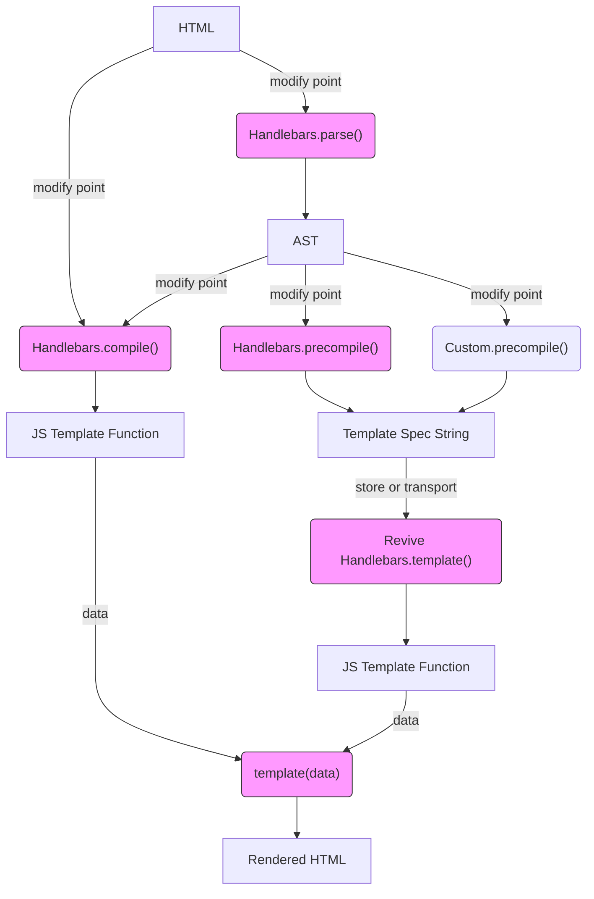

# Diagrams

- [Handlebars Workflow](https://mermaidjs.github.io/mermaid-live-editor/#/edit/eyJjb2RlIjoiZ3JhcGggVERcbkhUTUwgLS0-IHxtb2RpZnkgcG9pbnR8Zm5jQ29tcGlsZVxuSFRNTCAtLT58bW9kaWZ5IHBvaW50fGZuY1BhcnNlKFwiSGFuZGxlYmFycy5wYXJzZSgpXCIpXG5mbmNQYXJzZSAtLT4gQVNUXG5BU1QgLS0-fG1vZGlmeSBwb2ludHxmbmNDb21waWxlKFwiSGFuZGxlYmFycy5jb21waWxlKClcIilcbkFTVCAtLT58bW9kaWZ5IHBvaW50fGZuY1ByZWNvbXBpbGUoXCJIYW5kbGViYXJzLnByZWNvbXBpbGUoKVwiKVxuQVNUIC0tPnxtb2RpZnkgcG9pbnR8Zm5jUHJlY29tcGlsZUN1c3RvbShcIkN1c3RvbS5wcmVjb21waWxlKClcIilcblxuZm5jQ29tcGlsZSAtLT4gRltKUyBUZW1wbGF0ZSBGdW5jdGlvbl1cblxuRiAtLT4gfGRhdGF8Zm5jVGVtcGxhdGUoXCJ0ZW1wbGF0ZShkYXRhKVwiKVxuZm5jUHJlY29tcGlsZSAtLT4gR1tUZW1wbGF0ZSBTcGVjIFN0cmluZ11cbmZuY1ByZWNvbXBpbGVDdXN0b20gLS0-IEdbVGVtcGxhdGUgU3BlYyBTdHJpbmddXG5cbkcgLS0-fHN0b3JlIG9yIHRyYW5zcG9ydHxmbmNSZXZpdmUoXCJSZXZpdmUgSGFuZGxlYmFycy50ZW1wbGF0ZSgpXCIpXG5mbmNSZXZpdmUgLS0-SltKUyBUZW1wbGF0ZSBGdW5jdGlvbl1cbkogLS0-IHxkYXRhfGZuY1RlbXBsYXRlKFwidGVtcGxhdGUoZGF0YSlcIilcbmZuY1RlbXBsYXRlIC0tPlJIVE1MW1JlbmRlcmVkIEhUTUxdXG5cblxuY2xhc3NEZWYgZm5jU3R5bGUgZmlsbDojZjlmLHN0cm9rZTojMzMzLHN0cm9rZS13aWR0aDoxcHg7XG5jbGFzcyBmbmNQYXJzZSBmbmNTdHlsZTtcbmNsYXNzIGZuY0NvbXBpbGUgZm5jU3R5bGU7XG5jbGFzcyBmbmNQcmVjb21waWxlIGZuY1N0eWxlO1xuY2xhc3MgZm5jUmV2aXZlIGZuY1N0eWxlO1xuY2xhc3MgZm5jVGVtcGxhdGUgZm5jU3R5bGU7XG4iLCJtZXJtYWlkIjp7InRoZW1lIjoiZGVmYXVsdCJ9fQ)

