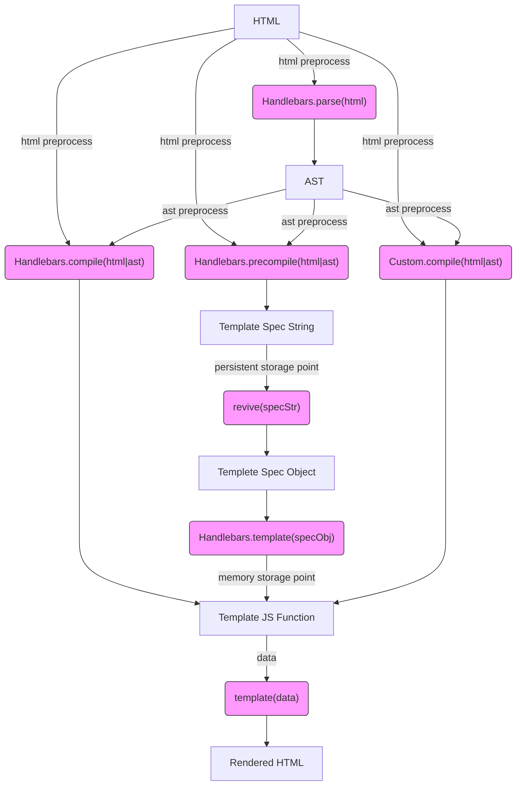

# Diagrams

## Handlebars Workflow
- [Mermaid Diagram](https://mermaidjs.github.io/mermaid-live-editor/#/edit/eyJjb2RlIjoiZ3JhcGggVERcbkhUTUwgLS0-IHxodG1sIHByZXByb2Nlc3N8Zm5jQ29tcGlsZVxuSFRNTCAtLT4gfGh0bWwgcHJlcHJvY2Vzc3xmbmNQcmVjb21waWxlXG5IVE1MIC0tPiB8aHRtbCBwcmVwcm9jZXNzfGZuY0NvbXBpbGVDdXN0b21cbkhUTUwgLS0-fGh0bWwgcHJlcHJvY2Vzc3xmbmNQYXJzZShcIkhhbmRsZWJhcnMucGFyc2UoaHRtbClcIilcbmZuY1BhcnNlIC0tPiBBU1RcbkFTVCAtLT58YXN0IHByZXByb2Nlc3N8Zm5jQ29tcGlsZShcIkhhbmRsZWJhcnMuY29tcGlsZShodG1sfGFzdClcIilcbkFTVCAtLT58YXN0IHByZXByb2Nlc3N8Zm5jUHJlY29tcGlsZShcIkhhbmRsZWJhcnMucHJlY29tcGlsZShodG1sfGFzdClcIilcbkFTVCAtLT58YXN0IHByZXByb2Nlc3N8Zm5jQ29tcGlsZUN1c3RvbShcIkN1c3RvbS5jb21waWxlKGh0bWx8YXN0KVwiKVxuZm5jQ29tcGlsZSAtLT4gRltKUyBUZW1wbGF0ZSBGdW5jdGlvbl1cbkYgLS0-IHxkYXRhfGZuY1RlbXBsYXRlKFwidGVtcGxhdGUoZGF0YSlcIilcbmZuY1ByZWNvbXBpbGUgLS0-IHNwZWNTdHJbVGVtcGxhdGUgU3BlYyBTdHJpbmddXG5zcGVjU3RyIC0tPnxwZXJzaXN0ZW50IHN0b3JhZ2UgcG9pbnR8Zm5jUmV2aXZlKFwicmV2aXZlKHNwZWNTdHIpXCIpXG5mbmNSZXZpdmUgLS0-c3BlY09ialtUZW1wbGV0ZSBTcGVjIE9iamVjdF1cbnNwZWNPYmogLS0-Zm5jUmVzdG9yZShcIkhhbmRsZWJhcnMudGVtcGxhdGUoc3BlY09iailcIilcbmZuY1Jlc3RvcmUgLS0-fG1lbW9yeSBzdG9yYWdlIHBvaW50fEZbVGVtcGxhdGUgSlMgRnVuY3Rpb25dXG5mbmNDb21waWxlQ3VzdG9tIC0tPiBGXG5mbmNUZW1wbGF0ZSAtLT5SSFRNTFtSZW5kZXJlZCBIVE1MXVxuXG5jbGFzc0RlZiBmbmNTdHlsZSBmaWxsOiNmOWYsc3Ryb2tlOiMzMzMsc3Ryb2tlLXdpZHRoOjFweDtcblxuY2xhc3MgZm5jUGFyc2UgZm5jU3R5bGU7XG5jbGFzcyBmbmNDb21waWxlIGZuY1N0eWxlO1xuY2xhc3MgZm5jUHJlY29tcGlsZSBmbmNTdHlsZTtcbmNsYXNzIGZuY0NvbXBpbGVDdXN0b20gZm5jU3R5bGU7XG5jbGFzcyBmbmNSZXZpdmUgZm5jU3R5bGU7XG5jbGFzcyBmbmNSZXN0b3JlIGZuY1N0eWxlO1xuY2xhc3MgZm5jVGVtcGxhdGUgZm5jU3R5bGU7XG4iLCJtZXJtYWlkIjp7InRoZW1lIjoiZGVmYXVsdCJ9fQ)

## Possible Sever Workflow

- [Mermaid Diagram](https://mermaidjs.github.io/mermaid-live-editor/#/edit/eyJjb2RlIjoiZ3JhcGggVERcbnN0YXJ0VGVtcGxhdGVbXCJUZW1wbGF0ZSBDaGFuZ2UgRXZlbnRcIl0gLS0-SFRNTFxuSFRNTFtcIlRlbXBsYXRlIEhUTUxcIl0gLS0-Zm5jSHRtbFByb2Nlc3NvcnMoXCJIVE1MLnByb2Nlc3NvcnMoaHRtbCk8YnI-Q1NTLCBMb2dpYywgSGVscGVycywgVmFyaWFibGVzPGJyPkRlY29yYXRvcnMsIERlZmVjdHNcIilcbmZuY0h0bWxQcm9jZXNzb3JzIC0tPmZuY1BhcnNlKFwiSGFuZGxlYmFycy5wYXJzZShodG1sKVwiKVxuZm5jUGFyc2UgLS0-IEFTVFtcIlRlbXBsYXRlIEFTVFwiXVxuQVNUIC0tPiBmbmNBc3RQcm9jZXNzb3JzKFwiQVNULnByb2Nlc3NvcnMoYXN0KTxicj5Mb2dpYywgSGVscGVycywgVmFyaWFibGVzPGJyPkRlY29yYXRvcnMsIERlZmVjdHNcIilcbmZuY0FzdFByb2Nlc3NvcnMgLS0-Zm5jUHJlY29tcGlsZShcIkhhbmRsZWJhcnMucHJlY29tcGlsZShhc3QpXCIpXG5mbmNQcmVjb21waWxlIC0tPiBzcGVjU3RyW1RlbXBsYXRlIFNwZWMgU3RyaW5nXVxuc3BlY1N0ciAtLT4gZGJTYXZlKFwiRGF0YWJhc2UgU2F2ZVwiKVxuXG5zdGFydFNldmVyW1wiU2VydmVyIFN0YXJ0dXBcIl0gLS0-c3BlY1N0cjJcbnNwZWNTdHIyW1wiR2V0IFRlbXBsYXRlIFNwZWMgU3RyaW5nczxicj5mcm9tIGRhdGFiYXNlXCJdIC0tPmZuY1Jldml2ZShcInJldml2ZShzcGVjU3RyKVwiKVxuZm5jUmV2aXZlIC0tPnNwZWNPYmpbVGVtcGxldGUgU3BlYyBPYmplY3RdXG5zcGVjT2JqIC0tPmZuY1Jlc3RvcmUoXCJIYW5kbGViYXJzLnRlbXBsYXRlKHNwZWNPYmopXCIpXG5mbmNSZXN0b3JlIC0tPkZbV2FybWVkIFRlbXBsYXRlIEpTIEZ1bmN0aW9uXVxuXG5zdGFydFJlbmRlcltcIlRlbXBsYXRlIFJlbmRlciBFdmVudFwiXSAtLT4gdGVtcGxhdGVVcGRhdGVzXG50ZW1wbGF0ZVVwZGF0ZXNbXCJHZXQgVGVtcGxhdGUgVXBkYXRlc1wiXSAtLT5kYXRhW1wiR2V0IExvYW4gRGF0YVwiXVxuZGF0YSAtLT4gZm5jVGVtcGxhdGUoXCJ0ZW1wbGF0ZShkYXRhKVwiKVxuZm5jVGVtcGxhdGUgLS0-UkhUTUxbUmVuZGVyZWQgSFRNTF1cblxuY2xhc3NEZWYgZm5jU3R5bGUgZmlsbDojZjlmLHN0cm9rZTojMzMzLHN0cm9rZS13aWR0aDoxcHg7XG5cbmNsYXNzIGZuY1BhcnNlIGZuY1N0eWxlO1xuY2xhc3MgZm5jUHJlY29tcGlsZSBmbmNTdHlsZTtcbmNsYXNzIGZuY1Jldml2ZSBmbmNTdHlsZTtcbmNsYXNzIGZuY1Jlc3RvcmUgZm5jU3R5bGU7XG5jbGFzcyBmbmNUZW1wbGF0ZSBmbmNTdHlsZTtcbiIsIm1lcm1haWQiOnsidGhlbWUiOiJkZWZhdWx0In19)