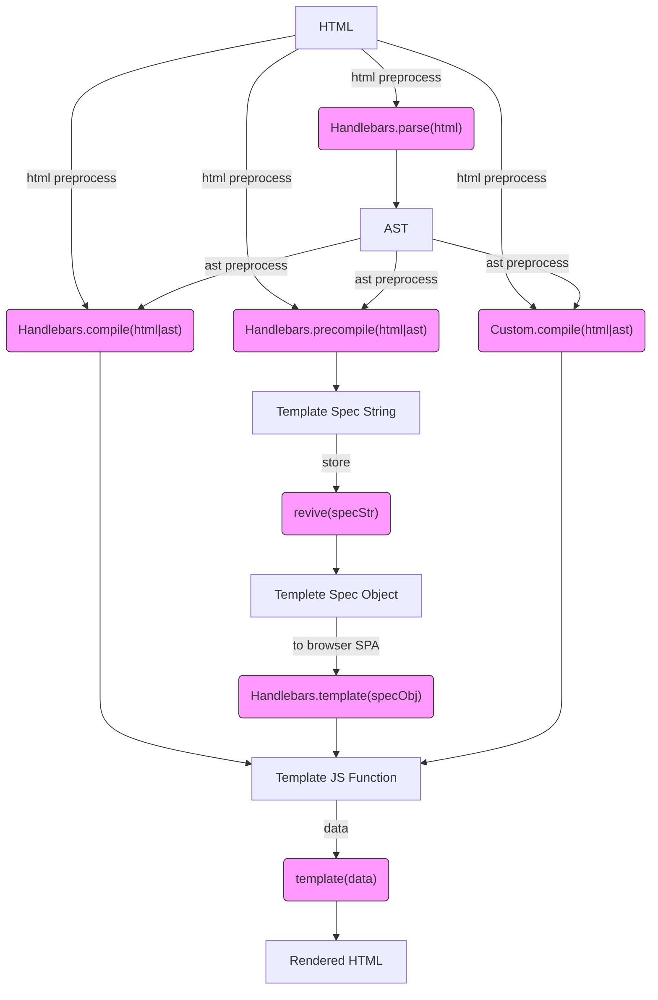

# Diagrams

- [Handlebars Workflow](https://mermaidjs.github.io/mermaid-live-editor/#/edit/eyJjb2RlIjoiZ3JhcGggVERcbkhUTUwgLS0-IHxodG1sIHByZXByb2Nlc3N8Zm5jQ29tcGlsZVxuSFRNTCAtLT4gfGh0bWwgcHJlcHJvY2Vzc3xmbmNQcmVjb21waWxlXG5IVE1MIC0tPiB8aHRtbCBwcmVwcm9jZXNzfGZuY0NvbXBpbGVDdXN0b21cbkhUTUwgLS0-fGh0bWwgcHJlcHJvY2Vzc3xmbmNQYXJzZShcIkhhbmRsZWJhcnMucGFyc2UoaHRtbClcIilcbmZuY1BhcnNlIC0tPiBBU1RcbkFTVCAtLT58YXN0IHByZXByb2Nlc3N8Zm5jQ29tcGlsZShcIkhhbmRsZWJhcnMuY29tcGlsZShodG1sfGFzdClcIilcbkFTVCAtLT58YXN0IHByZXByb2Nlc3N8Zm5jUHJlY29tcGlsZShcIkhhbmRsZWJhcnMucHJlY29tcGlsZShodG1sfGFzdClcIilcbkFTVCAtLT58YXN0IHByZXByb2Nlc3N8Zm5jQ29tcGlsZUN1c3RvbShcIkN1c3RvbS5jb21waWxlKGh0bWx8YXN0KVwiKVxuZm5jQ29tcGlsZSAtLT4gRltKUyBUZW1wbGF0ZSBGdW5jdGlvbl1cbkYgLS0-IHxkYXRhfGZuY1RlbXBsYXRlKFwidGVtcGxhdGUoZGF0YSlcIilcbmZuY1ByZWNvbXBpbGUgLS0-IHNwZWNTdHJbVGVtcGxhdGUgU3BlYyBTdHJpbmddXG5zcGVjU3RyIC0tPnxzdG9yZXxmbmNSZXZpdmUoXCJyZXZpdmUoc3BlY1N0cilcIilcbmZuY1Jldml2ZSAtLT5zcGVjT2JqW1RlbXBsZXRlIFNwZWMgT2JqZWN0XVxuc3BlY09iaiAtLT58dG8gYnJvd3NlciBTUEF8Zm5jUmVzdG9yZShcIkhhbmRsZWJhcnMudGVtcGxhdGUoc3BlY09iailcIilcbmZuY1Jlc3RvcmUgLS0-RltUZW1wbGF0ZSBKUyBGdW5jdGlvbl1cbmZuY0NvbXBpbGVDdXN0b20gLS0-IEZcbmZuY1RlbXBsYXRlIC0tPlJIVE1MW1JlbmRlcmVkIEhUTUxdXG5cbmNsYXNzRGVmIGZuY1N0eWxlIGZpbGw6I2Y5ZixzdHJva2U6IzMzMyxzdHJva2Utd2lkdGg6MXB4O1xuXG5jbGFzcyBmbmNQYXJzZSBmbmNTdHlsZTtcbmNsYXNzIGZuY0NvbXBpbGUgZm5jU3R5bGU7XG5jbGFzcyBmbmNQcmVjb21waWxlIGZuY1N0eWxlO1xuY2xhc3MgZm5jQ29tcGlsZUN1c3RvbSBmbmNTdHlsZTtcbmNsYXNzIGZuY1Jldml2ZSBmbmNTdHlsZTtcbmNsYXNzIGZuY1Jlc3RvcmUgZm5jU3R5bGU7XG5jbGFzcyBmbmNUZW1wbGF0ZSBmbmNTdHlsZTtcbiIsIm1lcm1haWQiOnsidGhlbWUiOiJkZWZhdWx0In19)

